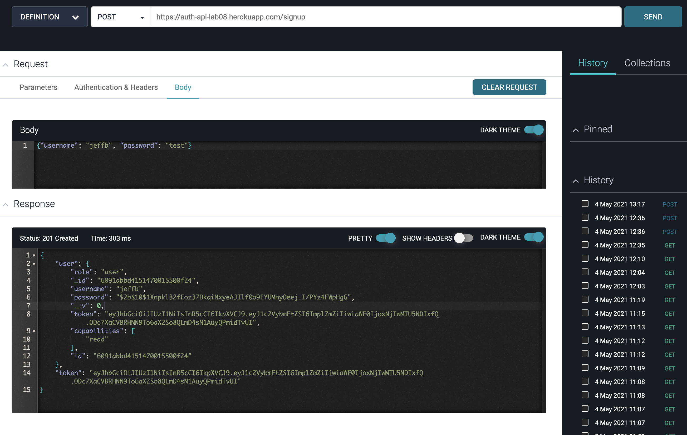
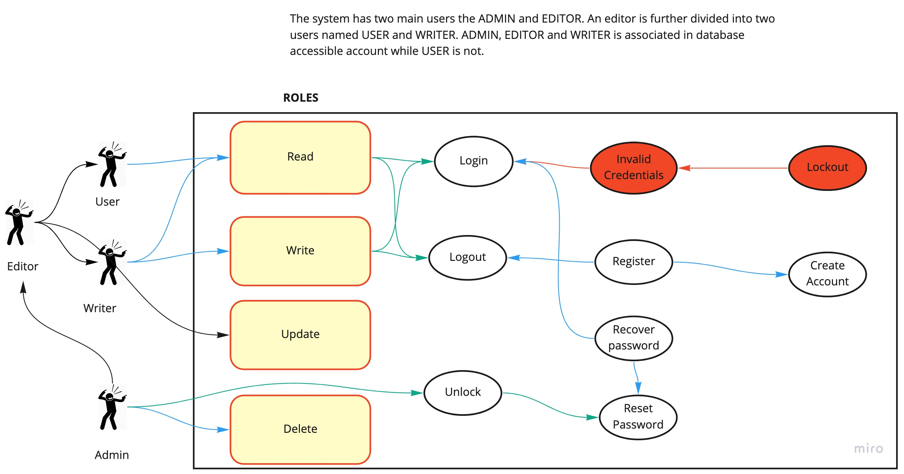

# LAB-08 
ACL: Access Control List (A role based acess control)

# Author: Clement Buchanan

- Test Report
- [Front End](https://auth-api-lab08.herokuapp.com/)

## Setup

- .env requirements
  - PORT - 3333

# Running the app

- node index.js
- Endpoint: /signup
  - Returns Object
    

## UML
(created with Miro)

## Tests
write test for

- Auth routes
  - post/signup
  - post/signin
- V1 routes
  - post/api/v1
  - get/api/v1/:model
  - get/api/v1:model/ID
  - put/api/v1/:model/ID
  - delete/api/v1/:model/ID
- V2 routes
  - post/api/v1
  - get/api/v1/:model
  - get/api/v1:model/ID
  - put/api/v1/:model/ID
  - delete/api/v1/:model/ID
